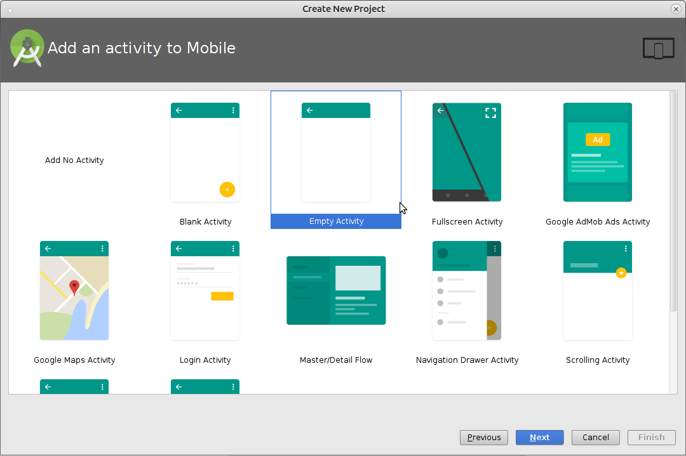
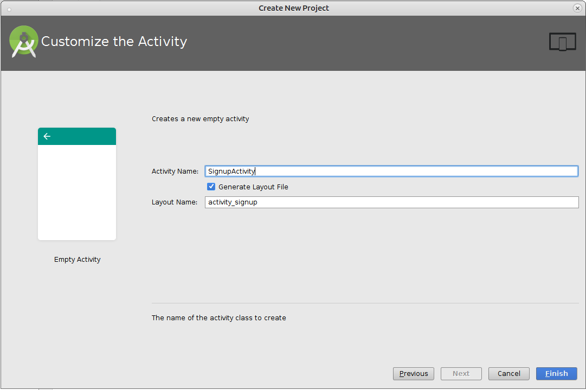
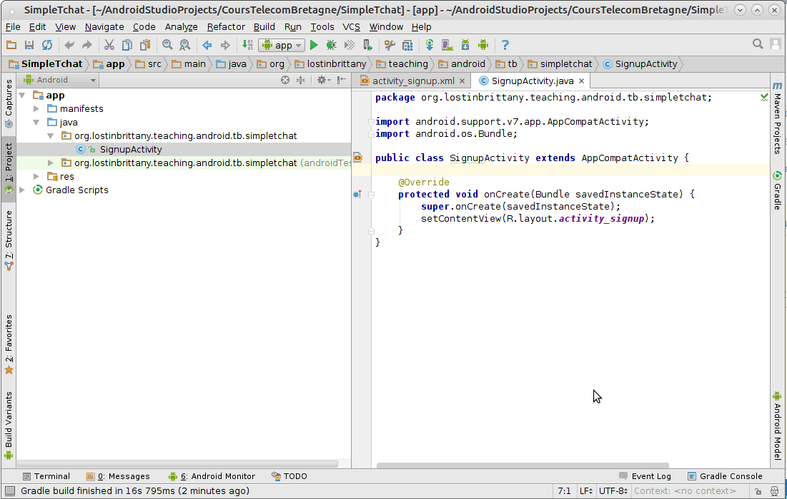
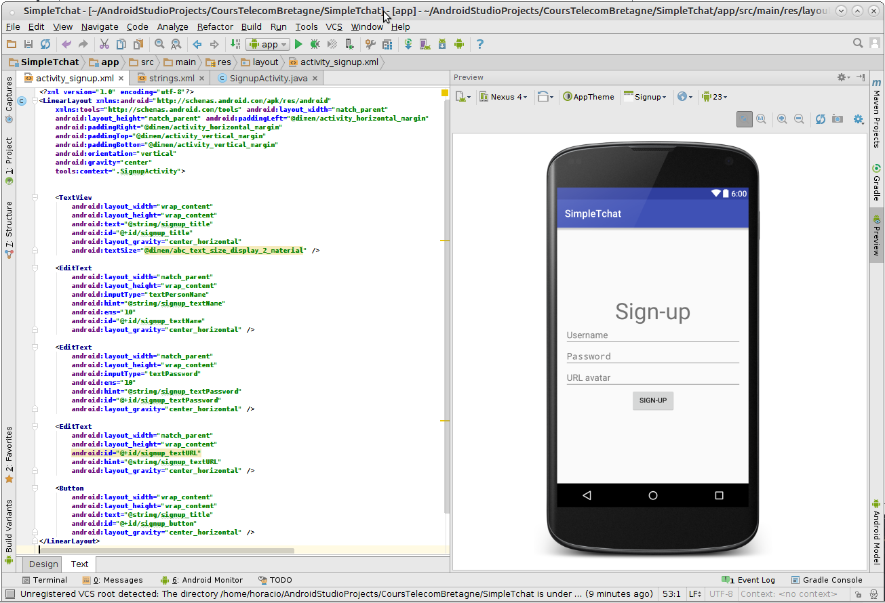
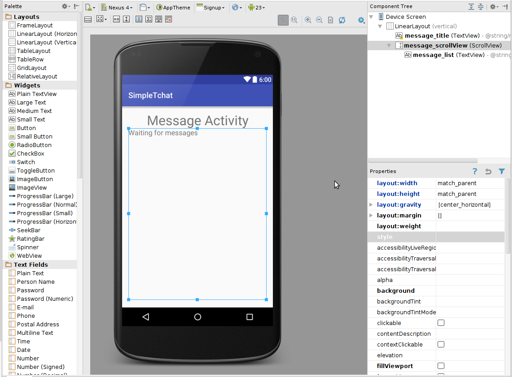
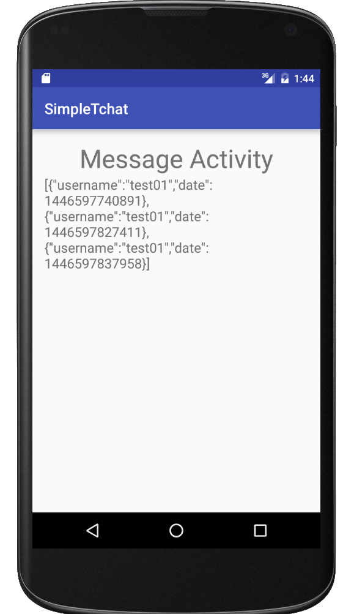
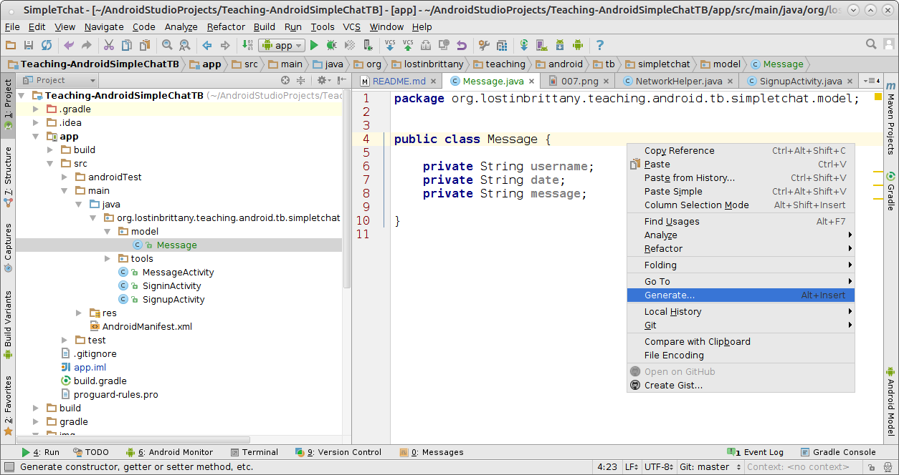
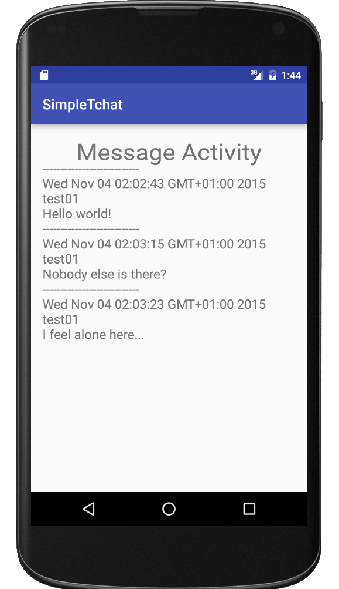
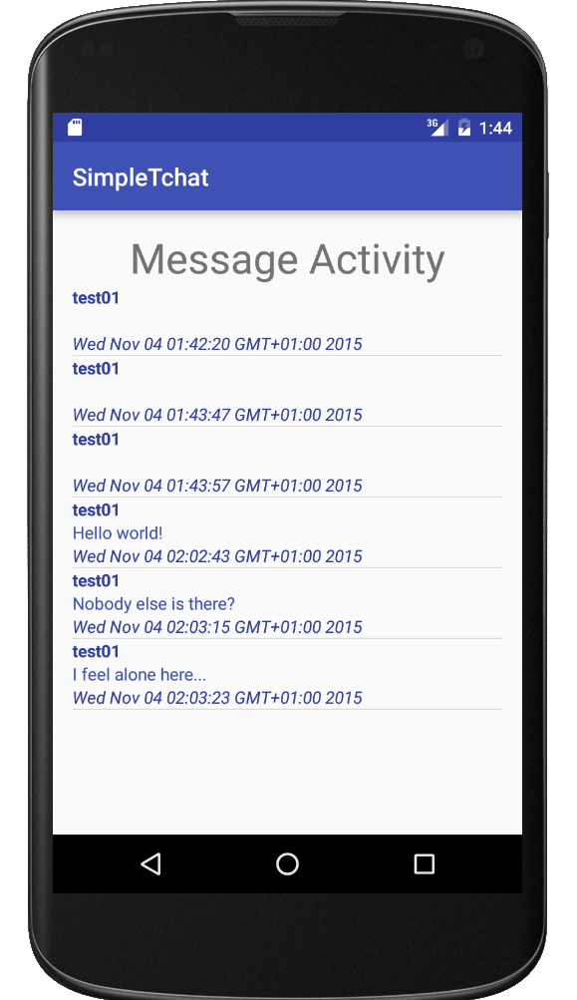

## Simple Tchat

This project is a teaching support for an introductory course to Android
development.

The tutorial relies on the use of the [Git](http://git-scm.com/) versioning system for source code management. You don't need to know anything about Git to follow the tutorial other than how to install and run a few git commands.

For every step, the solution is inside the corresponding step folder. Inside it you will find a `src` folder with the manifest, the Java code and the resources.

### Step-00: Create project

You begin a new project, `SimpleTchat`.


You choose to begin with an empty activity.



You call the activity `SignupActivity`.



And you have the new project in the IDE.




### Step-01: Create the activities


In this step you're going to create the three main Activities for the SimpleTchat:
`SignupActivity`, `SigninActivity` and `MessageActivity`:



For each Actitity you create the UI widgets, you give them unique ID and you
externalize all the strings.


Don't forget to tweak the manifest to mark `SigninActivity` as the main (launching)
one.

```xml
<?xml version="1.0" encoding="utf-8"?>
<manifest xmlns:android="http://schemas.android.com/apk/res/android"
    package="org.lostinbrittany.teaching.android.tb.simpletchat" >

    <application
        android:allowBackup="true"
        android:icon="@mipmap/ic_launcher"
        android:label="@string/app_name"
        android:supportsRtl="true"
        android:theme="@style/AppTheme" >
        <activity android:name=".SignupActivity" >
        </activity>
        <activity android:name=".SigninActivity" >
            <intent-filter>
                <action android:name="android.intent.action.MAIN" />
                <category android:name="android.intent.category.LAUNCHER" />
            </intent-filter>
        </activity>
        <activity android:name=".MessageActivity" >
        </activity>
    </application>

</manifest>

```


### Step-02: Plug the SignupActivity

You begin by placing a listener at `SigninActivity`'s `Signup` button and inside
it launching an Intent to change the Activity to the `SignupActivity`.

```java
public class SigninActivity extends AppCompatActivity {

    @Override
    protected void onCreate(Bundle savedInstanceState) {
        super.onCreate(savedInstanceState);
        setContentView(R.layout.activity_signin);

        Button btnSignup = (Button)findViewById(R.id.signin_button_signup);
        btnSignup.setOnClickListener(new View.OnClickListener() {
            @Override
            public void onClick(View v) {
                Intent intent = new Intent(getApplicationContext(), SignupActivity.class);
                startActivity(intent);
            }
        });

    }
}
```  

Then you give your application internet permissions:

```xml
<?xml version="1.0" encoding="utf-8"?>
<manifest xmlns:android="http://schemas.android.com/apk/res/android"
    package="org.lostinbrittany.teaching.android.tb.simpletchat" >

    <uses-permission android:name="android.permission.ACCESS_NETWORK_STATE" />
    <uses-permission android:name="android.permission.INTERNET" />

    <application [...]
```

And add a `NetworkHelper` class that will help you dealing with network.
You give it a `isInternetAvailable` method to verify network state:

```java
public static boolean isInternetAvailable(Context context) {
    try {
        ConnectivityManager cm
                = (ConnectivityManager) context.getSystemService(Context.CONNECTIVITY_SERVICE);

        NetworkInfo activeNetwork = cm.getActiveNetworkInfo();
        return activeNetwork != null && activeNetwork.isConnectedOrConnecting();
    } catch (Exception e) {
        Log.e("HelloWorld", "Error on checking internet:", e);

    }
    //default allowed to access internet
    return true;
}
```

A method to read the HTTP response:

```java
// Reads an InputStream and converts it to a String.
private static String readIt(InputStream stream) throws IOException, UnsupportedEncodingException {
    int ch;
    StringBuffer sb = new StringBuffer();
    while ((ch = stream.read()) != -1) {
        sb.append((char) ch);
    }

    Reader reader = null;
    reader = new InputStreamReader(stream, "UTF-8");

    while ((ch = reader.read()) != -1) {
        sb.append((char) ch);
    }
    return  sb.toString();
}
```

And a method `signup` to build a post request to the service URL.

Let's see again the details of the service:

> Base URL : http://lostinbrittany-simple-chat.cleverapps.io/
> POST /signup
> Description : Register a new user.
> Parameters
> - `username`	(string)	User login.
> - `pwd`	(string)	Password for this user.
> - `urlPhoto`	(string)	url to a picture for this user.

You're going to do it by creating a HttpURLConnection, and adding the parameters
to it:

```java
public static String signup(String username, String password, String urlPhoto) {
    try {
        URL url = new URL(BASE_URL+SIGNUP_SERVICE);
        HttpURLConnection conn = (HttpURLConnection) url.openConnection();
        conn.setReadTimeout(10000);
        conn.setConnectTimeout(15000);

        conn.setRequestMethod("POST");
        conn.setDoInput(true);
        conn.setDoOutput(true);

        StringBuilder params = new StringBuilder();
        params.append("username=").append(URLEncoder.encode(username, "UTF-8")).append("&")
                .append("pwd=").append(URLEncoder.encode(password, "UTF-8")).append("&")
                .append("urlPhoto=").append(URLEncoder.encode(urlPhoto, "UTF-8");

        OutputStream os = conn.getOutputStream();
        BufferedWriter writer = new BufferedWriter(
                new OutputStreamWriter(os, "UTF-8"));
        writer.write(params.toString());
        writer.flush();
        writer.close();
        os.close();

        conn.connect();

        int response = conn.getResponseCode();
        Log.d("NetworkHelper", "The response code is: " + response);


        return readIt(conn.getInputStream());

    } catch (MalformedURLException e) {
        e.printStackTrace();
    } catch (IOException e) {
        e.printStackTrace();
    }
    return null;
}
```

Then, in the `SignupActivity`, add a listener to the button that creates an AsyncTask that calls the service.
When it gets the answer, it deals with it and, if correct, it launches an intent to `SigninActivity`.

```java
private class SignupAsyncTask extends AsyncTask<String, Void, String> {

  @Override
  protected String doInBackground(String... params) {

    boolean networkAvailable = NetworkHelper.isInternetAvailable(getApplicationContext());
    Log.d("Available network?", Boolean.toString(networkAvailable));

    if (!networkAvailable) {
      return null;
    }
    String username = params[0];
    String password = params[1];
    String urlPhoto = params[2];

    return NetworkHelper.signup(username,password,urlPhoto);
  }

  @Override
  protected void onPostExecute(String result) {
    if (null != result) {
      Log.d("AsyncTask result", result);
      Toast.makeText(getApplicationContext(), result, Toast.LENGTH_LONG).show();
    } else {
      Log.d("AsyncTask", "Finished without error");
      Intent intent = new Intent(getApplicationContext(), SigninActivity.class);
      intent.putExtra("message", "User signed up");
      startActivity(intent);
    }
  }
}
```

### Step-03: Do the sign-in


Add a `signin` method to `NetworkHelper`. Remember:

> Base URL : http://lostinbrittany-simple-chat.cleverapps.io/
> POST /signin
> Description : Login to the app.
> Parameters
> - `username`	(string)	User login.
> - `pwd`	(string)	Password for this user.
> Output
> - token (in JSON format)

You'll need to parse the answer to recover the token.


```java
public static String signin(String username, String password, String urlPhoto) {
    try {
        URL url = new URL(BASE_URL+SIGNIN_SERVICE);
        HttpURLConnection conn = (HttpURLConnection) url.openConnection();
        conn.setReadTimeout(10000);
        conn.setConnectTimeout(15000);

        conn.setRequestMethod("POST");
        conn.setDoInput(true);
        conn.setDoOutput(true);

        StringBuilder params = new StringBuilder();
        params.append("username=").append(URLEncoder.encode(username, "UTF-8")).append("&")
                .append("pwd=").append(URLEncoder.encode(password, "UTF-8"));

        OutputStream os = conn.getOutputStream();
        BufferedWriter writer = new BufferedWriter(
                new OutputStreamWriter(os, "UTF-8"));
        writer.write(params.toString());
        writer.flush();
        writer.close();
        os.close();

        conn.connect();

        int response = conn.getResponseCode();
        Log.d("NetworkHelper", "The response code is: " + response);

        if (response >= 400) {
            return readIt(conn.getErrorStream());
        }
        String responseText = readIt(conn.getInputStream());
        return new JSONObject(responseText).optString("token");

    } catch (MalformedURLException e) {
        e.printStackTrace();
    } catch (IOException e) {
        e.printStackTrace();
    } catch (JSONException e) {
        e.printStackTrace();
    }
    return null;
}
```

Now in the `SigninActivity` you must create an AsyncTask et call this method, and
deal with the result...

```java
private class SigninAsyncTask extends AsyncTask<String, Void, String> {

     @Override
     protected String doInBackground(String... params) {

         boolean networkAvailable = NetworkHelper.isInternetAvailable(getApplicationContext());
         Log.d("Available network?", Boolean.toString(networkAvailable));

         if (!networkAvailable) {
             return null;
         }
         String username = params[0];
         String password = params[1];

         return NetworkHelper.signin(username, password);
     }

     @Override
     protected void onPostExecute(String result) {
         if (null == result) {
             Log.d("AsyncTask result", "null");
             return;
         }
         if (result.startsWith("Error:"))  {
             Log.d("AsyncTask result", result);
             Toast.makeText(getApplicationContext(), result, Toast.LENGTH_LONG).show();
         } else {
             Log.d("AsyncTask", "Finished without error");
             Intent intent = new Intent(getApplicationContext(), SigninActivity.class);
             intent.putExtra("message", "User signed in");
             intent.putExtra("token", result);
             startActivity(intent);
         }
     }
 }
```

### Step-04: Recover the message list

In the `activity_message.xml` layout we are adding a ScrollView (to get the scroll bar if needed) and
inside it a simple TextView to show the message list.





To recover the message list we need to call the `messages` service in the API.
As in precedent steps, add a `messageList` method to `NetworkHelper`. Remember:

> Base URL : http://lostinbrittany-simple-chat.cleverapps.io/
> GET /messages
> Description : Get messages in conferences..
> Parameters
> - none
> Headers
> - `token`	(string)	User token
> Output
> - List of messages

In step-03 you did a POST request, you can take it as inspiration, but you must remember two things:

- As you're doing a GET request, you need to suppress the `conn.setDoOutput(true);` line. The `setDoOutput`
  method creates a request body, and GET request haven't body.
  
- You don't send any parameters with this request, but you send a header with the token. Headers 
  are set by calling `conn.setRequestProperty(key,value)` 
  
```java
    public static String messageList(String token) {
        try {
            URL url = new URL(BASE_URL+MESSAGE_SERVICE);
            HttpURLConnection conn = (HttpURLConnection) url.openConnection();
            conn.setReadTimeout(10000);
            conn.setConnectTimeout(15000);

            conn.setRequestMethod("GET");
            conn.setDoInput(true);

            conn.setRequestProperty("token", token);

            conn.connect();

            int response = conn.getResponseCode();
            Log.d("NetworkHelper", "The response code is: " + response);

            if (response >= 400) {
                Log.e("getMessages", "Error: "+readIt(conn.getErrorStream()));
            }
            String responseText = readIt(conn.getInputStream());
            return responseText;

        } catch (MalformedURLException e) {
            e.printStackTrace();
        } catch (IOException e) {
            e.printStackTrace();
        }
        return null;
    }
```

In `MessageActivity` you create an AsyncTask that calls the `messageList` service in the API.
In its `onPostExecute` method you copy the message list into the layout's `@+id/message_list`:

```java
    private class MessageListAsyncTask extends AsyncTask<String, Void, String> {

        @Override
        protected String doInBackground(String... params) {

            boolean networkAvailable = NetworkHelper.isInternetAvailable(getApplicationContext());
            Log.d("Available network?", Boolean.toString(networkAvailable));

            if (!networkAvailable) {
                return null;
            }
            String token = params[0];
            return NetworkHelper.messageList(token);
        }

        @Override
        protected void onPostExecute(String messages) {

            TextView messageList = (TextView) findViewById(R.id.message_list);
            messageList.setText(messages);
        }
    }
```

And in the activity's `onCreate()` method, you execute the AsyncTaks when you have read the token.

So now, when you execute the application, you get the message list (in JSON format) in
 `MessageActivity`.




### Step-05: Decode the JSON list

Reset the workspace to step-05.

```
git checkout -f step-05
```

In this step we are going to decode the JSON message list. If we look to the received message list
we can see the structure of the messages:

```json
[
  {"username":"test01","date":1446598963059,"message":"Hello world!"},
  {"username":"test01","date":1446598995272,"message":"Nobody else is there?"},
  {"username":"test01","date":1446599003251,"message":"I feel alone here..."}]
```

So in order to deal with messages in our code, we create a `Message` class in a `model` package 
with the same three attributes: `username`, `date` and `message`. 
We can use Android Studio to automatically generate a constructor and getters and setters based
on the three private attributes.
 

 

Now we need to be able to parse the HTTP response with the message list into a `List<Message>` 
object. The simplest way to use it would be to add a JSON parsing method to `NetworkHelper`:

```java
    private static List<Message> getMessageFromJSON(String json) {
        List<Message> messages = new LinkedList<>();
        JSONArray array = null;
        try {
            array = new JSONArray(json);
            JSONObject obj;
            Message msg;
            for(int i=0; i < array.length(); i++){
                obj = array.getJSONObject(i);
                msg = new Message(
                        obj.optLong("date"),
                        obj.optString("username"),
                        obj.optString("message") );
                messages.add(msg);
            }

        } catch (JSONException e) {
            e.printStackTrace();
        }
        return messages;
    }
```

Then we modify the `messageList` method to return a `List<Message>` instead of a String.

```java
    return getMessageFromJSON(responseText);
```

And in `MessageActivity` we use `List<Message>` in the AsyncTask:

```java
        @Override
        protected void onPostExecute(List<Message> messages) {

            TextView messageList = (TextView) findViewById(R.id.message_list);
            StringBuilder sb = new StringBuilder();
            for (Message msg: messages) {
                sb.append("---------------------------\n");
                sb.append(new java.util.Date(msg.getDate())).append("\n")
                    .append(msg.getUsername()).append("\n")
                    .append(msg.getMessage()).append("\n");
            }
            messageList.setText(sb.toString());
        }
```


 

### Step-06: Using a ListView

In this step we are going to use a `ListView` widget. 
`ListView` is a view group that displays a list of scrollable items. 
The list items are automatically inserted to the list using an `Adapter` that pulls content from 
a source such as an array or database query and converts each item result into a view that's placed 
into the list.

> Adapters are used in Android when the content for your layout is dynamic or not pre-determined.
> You can then use a layout that subclasses `AdapterView` (liske `ListView`) to populate the layout 
> with views at runtime. 

> The `ListView` class; like other subclasses of `AdapterView`, uses an `Adapter` to bind data to its 
> layout. The `Adapter` behaves as a middleman between the data source and the `ListView` layout, 
> it retrieves the data (from a source such as an array or a database query) and converts each entry 
> into a view that can be added into the `ListView` layout.


So we begin by changing the message list `ScrollView` and its associated `TextView` by 
a `ListView` in `activity_message.xml` layout.


Then we create a `list_item.xml` layout to represent each item in the `ListView` widget. This layout 
is the UI element corresponding a each message of the list:

```xml
<?xml version="1.0" encoding="utf-8"?>
<LinearLayout xmlns:android="http://schemas.android.com/apk/res/android"
    android:orientation="horizontal" android:layout_width="match_parent"
    android:layout_height="match_parent">

    <LinearLayout
        android:orientation="vertical"
        android:layout_width="wrap_content"
        android:layout_height="match_parent">

        <TextView
            android:id="@+id/msg_user"
            android:layout_width="wrap_content"
            android:layout_height="wrap_content"
            android:textStyle="bold"
            android:textColor="@color/colorPrimaryDark"/>

        <TextView
            android:id="@+id/msg_message"
            android:layout_width="wrap_content"
            android:layout_height="wrap_content"
            android:textColor="@color/colorPrimaryDark"/>

        <TextView
            android:id="@+id/msg_date"
            android:layout_width="wrap_content"
            android:layout_height="wrap_content"
            android:textStyle="italic"
            android:textColor="@color/colorPrimaryDark" />
    </LinearLayout>
    
</LinearLayout>
```

Now we are going to implement the `Adapter` that will inflate (populate) this layout for each 
element of our `List<Message>`.  
So we create a `MessageAdapter` class that inflates the XML layout file, finds the relevant views in the layout and
sets their content based on the input data.

```java

    public class MessageAdapter  extends ArrayAdapter<Message> {
    
        private final Context context;
        private Message[] messages;
    
        public MessageAdapter(Context context) {
            super(context, -1);
            this.context = context;
        }
    
        public MessageAdapter(Context context, Message[] messages) {
            super(context, -1, messages);
            this.context = context;
            this.messages  = messages;
        }
    
        public void changeMessages(Message[] messages) {
            this.messages = messages;
        this.notifyDataSetChanged();
        }
    
        @Override
        public View getView(int position, View convertView, ViewGroup parent) {
            LayoutInflater inflater = (LayoutInflater) context
                    .getSystemService(Context.LAYOUT_INFLATER_SERVICE);
            View rowView = inflater.inflate(R.layout.item_message, parent, false);
    
            TextView username = (TextView) rowView.findViewById(R.id.msg_user);
            TextView date = (TextView) rowView.findViewById(R.id.msg_date);
            TextView message = (TextView) rowView.findViewById(R.id.msg_message);
    
            username.setText(messages[position].getUsername());
            date.setText(new java.util.Date(messages[position].getDate()).toString());
            message.setText(messages[position].getMessage());
    
            return rowView;
        }
    }
```

Now we can instantiate the adapter in `MessageActivity` and giving it to the `ListView` widget  
in the `onPostExecute` of the AsyncTask:
the adapter:

```java
        @Override
        protected void onPostExecute(List<Message> messages) {

            for (Message msg: messages.toArray(new Message[0])) {
                Log.d("message", msg.getUsername());
            }

            adapter = new MessageAdapter(getApplicationContext(),messages.toArray(new Message[0]));

            ListView listView = (ListView) findViewById(R.id.message_list);
            listView.setAdapter(adapter);
        }
```





### Step-07: Sending messages

Let's begin by adding the message sending method to our `NetworkHelper`.

```java
    public static String sendMessage(String message, String token) {
        try {
            URL url = new URL(BASE_URL+MESSAGE_SERVICE);
            HttpURLConnection conn = (HttpURLConnection) url.openConnection();
            conn.setReadTimeout(10000);
            conn.setConnectTimeout(15000);

            conn.setRequestMethod("POST");
            conn.setDoInput(true);

            conn.setRequestProperty("token", token);

            StringBuilder params = new StringBuilder();
            params.append("message=").append(URLEncoder.encode(message, "UTF-8"));

            OutputStream os = conn.getOutputStream();
            BufferedWriter writer = new BufferedWriter(
                    new OutputStreamWriter(os, "UTF-8"));
            writer.write(params.toString());
            writer.flush();
            writer.close();
            os.close();

            conn.connect();

            int response = conn.getResponseCode();
            Log.d("NetworkHelper", "The sendMessage response code is: " + response);
            return response;
        } catch (MalformedURLException e) {
            e.printStackTrace();
        } catch (IOException e) {
            e.printStackTrace();
        }
        return -1;
    }
```


Now add a message writing panel to `activity_message.xml`:


```xml
    <LinearLayout
        android:layout_width="match_parent"
        android:layout_height="wrap_content"
        android:orientation="horizontal">

        <EditText
            android:id="@+id/editMessage"
            android:layout_width="wrap_content"
            android:layout_height="wrap_content"
            android:layout_weight="1"
            android:ems="10"
            android:inputType="textPersonName"
            android:text="@string/message_edit" />

        <Button
            android:id="@+id/btnSendMessage"
            android:layout_width="wrap_content"
            android:layout_height="wrap_content"
            android:layout_weight="1"
            android:text="@string/message_send" />
    </LinearLayout>
```

And in `MessageActivity` create the listener for the *send* button.

```java
    @Override
    protected void onCreate(Bundle savedInstanceState) {
        super.onCreate(savedInstanceState);
        setContentView(R.layout.activity_message);

        Bundle extras = getIntent().getExtras();
        if (null != extras) {
            String token = extras.getString("token");
            if (null != token) {
                MessageListAsyncTask asyncTask = new MessageListAsyncTask();
                asyncTask.execute(token);
            }
        }

        Button btnSendMessage = (Button) findViewById(R.id.btnSendMessage);
        btnSendMessage.setOnClickListener(new View.OnClickListener() {
            @Override
            public void onClick(View v) {
  
            }
        });
    }
```

Now, as usual, you can create an `AsyncTask` to send the message to the server.

```java
    private class SendMessageAsyncTask extends AsyncTask<String, Void, Integer> {

        @Override
        protected Integer doInBackground(String... params) {

            boolean networkAvailable = NetworkHelper.isInternetAvailable(getApplicationContext());
            Log.d("Available network?", Boolean.toString(networkAvailable));

            if (!networkAvailable) {
                return null;
            }
            String message = params[0];
            return NetworkHelper.sendMessage(message, token);
        }

        @Override
        protected void onPostExecute(Integer result) {

            if (200 == result) {
                EditText editMessage = (EditText) findViewById(R.id.editMessage);
                editMessage.setText("");

                MessageListAsyncTask asyncTask = new MessageListAsyncTask();
                asyncTask.execute(token);
            }

        }
    }
```

And you call it from the listener:

```java
        btnSendMessage.setOnClickListener(new View.OnClickListener() {
            @Override
            public void onClick(View v) {
                EditText editMessage = (EditText) findViewById(R.id.editMessage);
                String message = editMessage.getText().toString();

                SendMessageAsyncTask asyncTask = new SendMessageAsyncTask();
                asyncTask.execute(message);

            }
        });
```

And here you have, at last, your fully functional SimpleTchat


You can also add a manual refresh button while waiting for the automatic refresh:


```xml
    <LinearLayout
        android:layout_width="match_parent"
        android:layout_height="wrap_content"
        android:layout_gravity="center_horizontal"
        android:orientation="horizontal">

        <TextView
            android:layout_width="wrap_content"
            android:layout_height="wrap_content"
            android:text="@string/message_title"
            android:id="@+id/message_title"
            android:layout_weight="1"
            android:layout_gravity="center_horizontal"
            android:textSize="@dimen/abc_text_size_display_1_material" />

        <Button
            android:id="@+id/btnRefresh"
            android:layout_width="wrap_content"
            android:layout_height="wrap_content"
            android:text="@string/message_refresh" />
    </LinearLayout>
```

And the corresponding listener to refresh the message list:

```java
        Button btnRefresh = (Button) findViewById(R.id.btnRefresh);

        btnRefresh.setOnClickListener(new View.OnClickListener() {
            @Override
            public void onClick(View v) {
            refreshMessages();
            }
        });
```        

